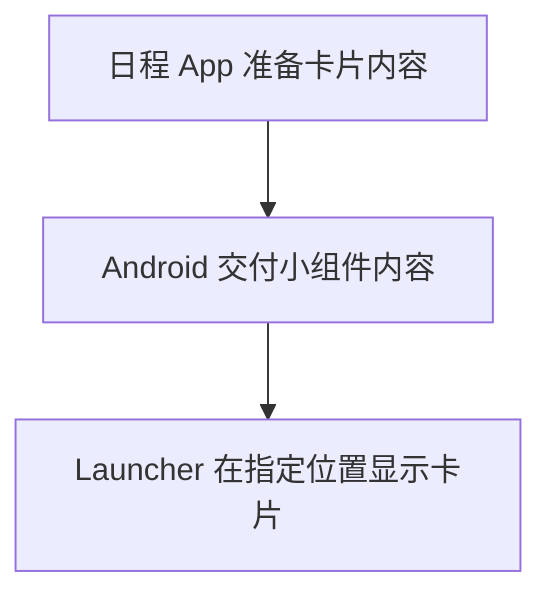

# 01 · 桌面、壁纸和小组件分别是什么

[目录](README.md) · 下一章：[Launcher 能改什么](02-launcher.md)

拿起手机，回到主屏幕。假设你看见一张山景背景，上面有“14:00 项目会议”的日程卡片，下面摆着相机、微信等图标。

这张画面里有三种分工。先从看得见的东西认识它们。

## 背景、卡片和整个主屏幕

**山景是壁纸。** 它提供背景。如果山上的云在移动，就可能是一张动态壁纸。更换背景时，日程卡片和图标仍可以留在原处。

**这张可添加到桌面的日程卡片，是小组件。** 日程 App 提供会议时间和标题，你把它放到主屏幕，就不用每次打开 App 才能看见下一场会议。

**组织图标和小组件的程序叫 Launcher，中文通常叫桌面或桌面启动器。** 它安排主屏幕的布局，处理图标点击，并在支持时为小组件提供摆放空间。手机出厂时通常已经选好了厂商自己的 Launcher。

| 你的操作 | 改变的部分 |
|---|---|
| 山景换成渐变背景 | 壁纸 |
| 添加或移走日程卡片 | 小组件 |
| 把整个主屏幕换成“日程、任务和应用搜索”的布局 | Launcher |

**给现有桌面提供小组件或动态壁纸，不需要先开发 Launcher。** 就像日程 App 和相机可以分别安装，负责主屏幕不同部分的程序也可以分工。

## 卡片由 App 提供，为什么会出现在另一个程序里

日程 App 知道会议内容，Launcher 知道桌面上哪里有空间。Android 提供一套小组件机制，让两边合作：

日程 App 是**提供者**；Launcher 是**宿主**，也就是接纳并显示这块内容的程序。后面看到这两个词，就把它们放回图里的两端。[A03](references.md#a03)

壁纸走另一条路径：系统管理壁纸的显示，动态壁纸程序负责绘制背景。它不需要成为 Launcher 里的普通页面。[A09](references.md#a09)

同一个 App 也可以同时提供自己的页面、小组件和壁纸。例如，页面负责编辑会议，小组件显示下一场会议，壁纸负责一天中的背景变化。

## 主屏幕与锁屏也要分开

返回 Home 后看到的是主屏幕，由 Launcher 负责。手机尚未解锁时看到的是锁屏，由系统管理。**更换 Launcher，不会因此把锁屏也换掉。**

“卡片”只是界面的外形。主屏幕上的日程卡片可能是小组件，锁屏上的“会议改期了”可能是通知。是否属于同一种能力，要看它怎样接入系统，不能只看都长得像长方形。

第六章会专门辨认锁屏上的不同卡片。现在先记住：显示位置与内容能力是两个问题。

## 数据从哪里来，是第三个问题

日程卡片可以读取本地保存的会议；背景可以只根据手机时间变化。两者都不必依赖推送。

如果会议在服务器上改期，手机先要得知变化，才谈得上更新卡片或发出提醒。这时才进入推送和数据同步的范围：**先取得新信息，再决定在哪些界面显示。** 第五章会沿这条路径走一遍。

下一章先研究 Launcher：如果我们想改变整个主屏幕，它能让我们改到什么程度？
