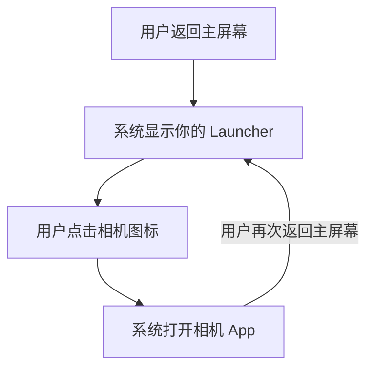

# 02 · Launcher 能改什么，国产手机能不能换

[目录](README.md) · 上一章：[三者的关系](01-capability-map.md) · 下一章：[动态壁纸](03-live-wallpapers.md)

**Launcher 本身就是一个 App，可以自己开发。** 用户通过手机支持的设置流程选定它以后，回到主屏幕时就会进入它。

## “自定义桌面”有三种程度

第一种是在原有桌面里改设置：调整图标大小、网格、主题、文件夹等。你使用的仍是厂商桌面，能改多少取决于它提供哪些选项。

第二种是安装别人开发的 Launcher，然后在系统设置中把它选为默认桌面。以后回到主屏幕时，就进入新桌面。

第三种是自己写一个 Launcher。它可以用 Kotlin 和 Android 原生 UI 技术实现，主屏幕布局、应用搜索、分组方式、自己的信息区都可以由你设计。完成后，它也需要经过第二种方式中的“设为默认桌面”这一步。[A01](references.md#a01)、[A02](references.md#a02)

例如，你可以把主屏幕设计成“上方日程、中间任务、下方应用搜索”，自行决定信息组织和交互方式。

## 换掉 Launcher 后，手机发生了什么

假设用户已经选择你开发的桌面。之后的一次操作是这样的：

你的 Launcher 决定图标放在哪里，并请求系统打开相机。相机仍然是相机 App，已经安装的其他应用和它们的数据也不会因为更换桌面而被替换。

你的桌面布局则需要自己管理。原桌面中的文件夹、图标位置和小组件摆放，不会因为选择了新 Launcher 就必然自动迁移过来。

## 能自定义到哪里

Launcher 可以负责主屏幕内的布局和交互：应用列表、图标排列、搜索、文件夹、自定义信息区。

这里还有一个容易混淆的区别：**你自己的 Launcher 可以直接绘制自己的日程区域；如果要让用户放入其他 App 的小组件，才需要承担小组件宿主的职责。** 宿主接纳对方提供的内容，安排位置和尺寸。[A03](references.md#a03)

锁屏、下拉通知栏、系统导航、最近任务等涉及另外的系统功能。**成为默认桌面，不会自动取得替换这些系统界面的能力。** 例如，自定义“在桌面空白处上滑打开搜索”，与接管系统的返回或多任务手势，是不同层面的事。

## 国产手机支持吗

**有支持的，但不能按“国产”给出统一结论。** 判断一台手机时，需要分三步：

| 要确认的事 | 它说明什么 |
|---|---|
| Launcher 能安装和打开 | 这个 App 可以运行 |
| 能在系统中设为默认桌面 | 回到主屏幕时可以进入它 |
| 日常导航和重启后的行为符合预期 | 它适合在这台手机上长期使用 |

前一步成立，不足以代替后一步。系统版本、国行或海外版本，也可能改变设置入口和行为。

一个明确的例子是 vivo 官方提供了“允许更换桌面”和“选择默认桌面”的操作说明。这证明有官方支持路径，但该页面没有给出所有机型、版本的保证。[A18](references.md#a18)

小米目前核对到的是指定平板的说明，华为目前核对到的是区分系统版本的排查文档。它们不能合并成一张全品牌支持表，证据范围集中放在[厂商资料](references.md#device-support)。用户的具体手机，以及 OPPO、荣耀等尚未完成适配核对。

## 对当前学习的意义

我们可以先把“自定义整个主屏幕”当作一项独立能力学习。同时保留小组件和动态壁纸这两条路径：即使某台手机不允许更换默认桌面，也不能仅据此断定它不支持添加小组件或选择动态壁纸，因为那是其他系统入口。

需要进入代码层时，再看[Launcher 接口笔记](native-api-notes.md#launcher)。接下来我们保留用户原有的桌面，研究其中可以单独更换的一部分：背景。
