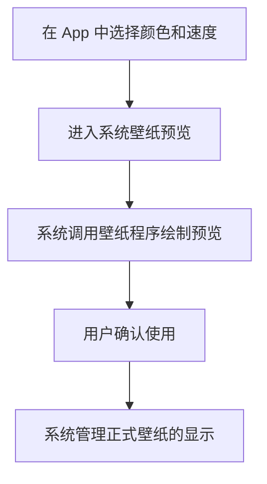

# 03 · 动态壁纸是怎样动起来的

[目录](README.md) · 上一章：[Launcher](02-launcher.md) · 下一章：[小组件](04-app-widgets.md)

假设日程 App 还提供一张背景：清晨是浅蓝色，到了夜晚渐渐变暗，光点缓慢移动。

**动态壁纸是一段负责绘制背景的程序。** 它可以按时间、动画或已有数据生成画面。先沿着用户选用它的过程理解。

## 设置页面与真正的壁纸是两部分

你打开 App，选择颜色和光点速度，然后进入系统的壁纸预览。预览里已经能看到光点移动：这时系统就已经连接壁纸程序，让它开始绘制。满意后，再确认使用。[A09](references.md#a09)、[A11](references.md#a11)

设置页面负责让用户作选择，壁纸程序负责画背景。关掉设置页面后，系统仍可以通过壁纸入口调用绘制，所以背景不需要依附于那张设置页面。

静态壁纸更简单：App 把图片交给系统使用即可。动态壁纸则要在画面需要变化时提交新画面。正式显示与预览不必共用同一个绘制对象，具体由系统管理。

## 为什么不能一直不停地画

你打开一个完全遮住背景的阅读 App，此时已经看不见光点。继续计算每一帧，通常只会消耗资源。

Android 会通知壁纸是否可见，以及绘制区域是否可用、尺寸是否变化。壁纸程序据此安排工作：可见且可以绘制时按需要更新；不可见时停止不必要的持续绘制。[A10](references.md#a10)

这些创建、显示、隐藏和销毁的过程，合起来就是这里说的**生命周期**。开发者需要在合适的时机开始和停止工作。

因此，耗电取决于实际画面和绘制方式。只在时间变化时换一次颜色，与持续计算复杂三维动画，所需资源会有很大差别；具体数值还需要实测。

## 壁纸适合哪种信息

壁纸适合背景氛围、动画和简洁的视觉反馈。日程 App 可以让它随时间变亮变暗；完整的会议标题、详情按钮，则由小组件或 App 页面更自然地承载。

壁纸也有部分触摸能力，但系统如何传递手势与普通页面不同。主屏幕与锁屏能否分别选用这张动态壁纸，也取决于目标手机的选择入口和系统实现。

## 背景需要联网吗

如果只是按本地时间改变颜色，不需要联网。如果颜色要表达远端任务状态，就需要 App 先取得并保存数据，壁纸再读取它来决定画面。

**获取新数据与绘制动画是两项工作。** 光点每一帧移动，不需要每一帧都请求服务器；壁纸的绘制入口也不会自动解决后台同步。

理解到这里，再查[壁纸接口笔记](native-api-notes.md#wallpaper)，就能把服务入口、绘制对象与生命周期回调放回各自的位置。
