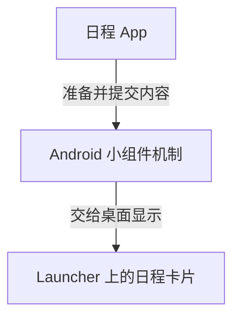

# 04 · 小组件为什么能留在桌面上

[目录](README.md) · 上一章：[动态壁纸](03-live-wallpapers.md) · 下一章：[连接推送通知](05-data-and-lifecycle.md)

**小组件是 App 提供给宿主显示的一块信息或操作区域。** 本章的宿主是 Launcher，讨论用户添加到桌面的日程、天气等小组件。锁屏上的音乐控制卡片则留到第六章辨认。

假设我们做了一张日程卡片，显示“14:00 项目会议”。从用户把它放上桌面开始看。

## 添加以后，谁负责这张卡片

安装 App 后，这张卡片不会必然自动占据桌面。用户在支持小组件的桌面中选择它、按需要配置，并放到一个位置。日程 App 准备标题、时间和点击动作，Launcher 负责让它出现在所选位置。[A03](references.md#a03)、[A04](references.md#a04)

日程 App 不需要一直打开自己的页面。它执行代码的运行环境称为进程；即使这个进程后来被系统回收，系统和桌面仍可以保留已经提交的卡片内容。[A08](references.md#a08)

但保留已有内容与取得新内容，是接下来的两个不同步骤。

## 会议改成 15:00，卡片怎样变化

App 得知会议改期后，先更新日程数据，再提交新的卡片内容。桌面收到更新，才把“14:00”改成“15:00”。

所以，App 里的数据变了，卡片不会无条件自动跟着变。App 需要完成一次明确的更新操作。

这次操作可以发生在用户修改日程后、用户点击刷新后，或者手机获准处理新消息时。App 不在活动状态时，也可以安排系统以后执行同步任务；实际执行时间受网络和系统调度影响。

这也解释了为什么天气卡片可能暂时显示旧温度。小组件是一块可以更新的界面，本身不保证数据随时是最新的。显示“上次更新于……”能帮助用户理解当前内容。

## 点击后为什么能打开具体页面

App 在提交卡片时，同时登记点击后要执行的动作。例如，把会议 ID 交给自己的详情页面。

用户点击卡片，系统便按已登记的动作打开目标。随后，详情页读取该会议的数据。如果需要联网或登录，那仍由打开后的页面处理。

卡片也可以有简单按钮，例如“完成这项待办”。是否支持某种操作，要看小组件机制允许的界面和动作；完整表单、复杂手势等通常留在 App 页面中更合适。

## 它与普通 App 页面有什么不同

普通页面由 App 自己显示。小组件的内容要交给另一个程序显示，因此 Android 规定了可用的布局、控件和交互方式。

原生实现有传统的 RemoteViews 和较新的 Jetpack Glance 等编写方式。它们最终都要遵守小组件的显示规则；即使页面使用 Compose 编写，也不能直接把任意页面原样放到桌面。具体名称和区别放在[接口查阅页](native-api-notes.md#widgets)。[A05](references.md#a05)、[A07](references.md#a07)

同一款小组件还可以放两份：一张显示工作日程，一张显示个人日程。App 必须分别保存每张卡片的选择；桌面则负责它们各自的位置和尺寸。

## 小组件能有动画吗

**可以有，但要看是哪种动画。** 小组件由桌面等宿主显示，能使用宿主支持的动态控件和切换效果；不能直接照搬普通 App 页面的所有动画。

| 想要的效果 | 可以怎样理解 |
|---|---|
| 倒计时数字变化、时钟走动 | 支持的时间控件可以自行变化，不必每秒让 App 提交一张新卡片 |
| 加载中的进度指示 | 支持的系统进度控件可以表现不确定进度；不等于真实任务进度在自动变化 |
| 几张日程或图片轮播、切换时淡入淡出 | 传统 RemoteViews 支持 ViewFlipper 等有限切换能力，具体效果需适配宿主 |
| 列表滑动后整张卡片吸附对齐 | 新版 Glance 文档提供 Snap Scrolling，但有系统和库版本要求 |
| 实时交互的桌宠、粒子模拟、复杂三维动画 | 不能按普通页面的绘制方式直接嵌入；应先研究专门的渲染方案或动态壁纸 |

例如，小组件可以把下一场会议换成下下场会议，切换效果由宿主中的支持控件执行；这与 App 每秒联网、每帧重新生成小组件是不同的事情。前面说的后台更新限制，主要影响 App 何时取得并提交新内容，不意味着已有控件完全不能动。[A25](references.md#a25)、[A26](references.md#a26)

这里还有一个版本变化：官方 Glance 指南已经介绍通过 Remote Compose 实现的吸附滚动，要求 Android 17、compileSdk 37 及 Glance 1.3.0-alpha02 或更高的适用版本。它是具体的新能力，不能外推成普通 Compose 动画都可以使用。[A27](references.md#a27)

因此，设计小组件动画时，先明确是“切换卡片”“显示计时”还是“持续绘制场景”，再看目标手机和原生接口支持哪条路径。本轮核对了接口资料，尚未实机验证动画。

## 具体例子：小猫循环吐彩虹

如果小猫待在小组件里，只循环播放一段预先设计的动作，可以先试**逐帧图片切换**：准备一组图片，每张画出动作的一个瞬间，连续显示后就产生动画。

例如：小猫张嘴 → 彩虹出现 → 彩虹条纹向外移动 → 循环。为避免接缝，最后一帧与第一帧的变化应能自然衔接。简单版本可以直接把猫和彩虹合成每一帧，降低实现复杂度。

一个原生 Android 验证方案是：

1. 准备少量同尺寸、透明背景的动画帧，放进 App 资源中。
2. 使用传统 RemoteViews 小组件布局，放一个 `ViewFlipper`，每个子 `ImageView` 显示一帧。
3. 用轮换间隔和自动启动配置，让宿主中的控件循环切换；帧之间直接切换即可，不必加淡入淡出。
4. 用户把小组件放到桌面后，观察效果，再验证切换桌面页、打开其他 App、锁屏、返回桌面和调整尺寸后的表现。[A25](references.md#a25)、[A26](references.md#a26)

可以把 8 帧、约每 125 毫秒切换一次作为小规模实验参数，即约一秒一个循环。这是试验起点，不是已测出的性能指标，也不是系统保证的帧率。素材应尽量小；增加帧数、分辨率和实例数量都会增加宿主需要处理的资源。

这种方案的工作是“宿主轮流显示已经交付的图片”，不需要 App 每帧更新小组件或一直联网。普通 ImageView 中放一个 GIF 文件，也不能直接假定它会像 App 内的 GIF 播放库那样工作；应明确选择受支持的播放机制。

这个小猫仍在小组件的矩形区域内。若希望它跨过桌面图标、跟随手指到处跑，需求已经超出普通小组件；若希望整个背景都有流动彩虹，则可以研究动态壁纸。**预先画好的循环动画与实时模拟、自由移动的桌宠，是不同难度和接入方式。**

目前这个方案是依据控件能力提出的验证路线，尚未生成素材、实现 Android 工程或做实机测试。

下一章从服务端的那次“会议改期”开始，看看手机怎样取得更新卡片所需的新信息。
