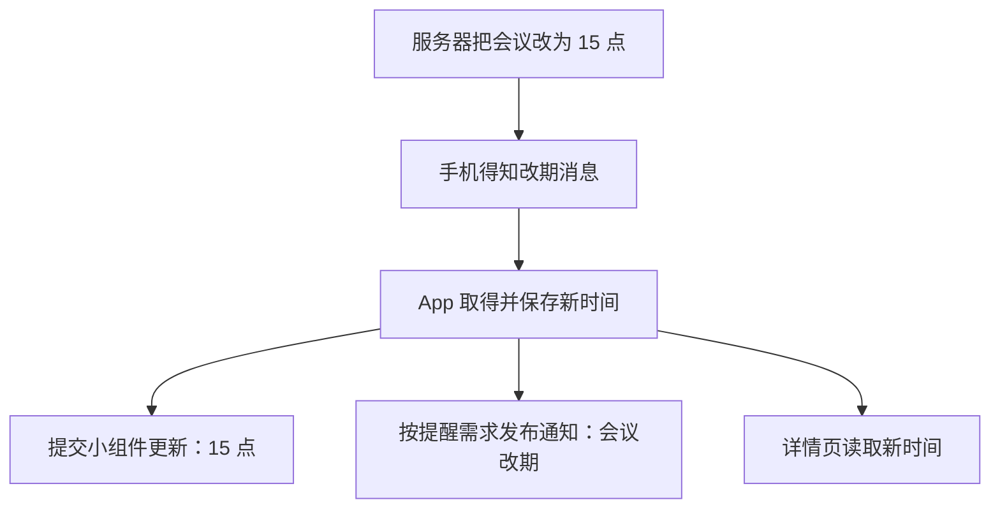

# 05 · 它们怎样与推送通知一起工作

[目录](README.md) · 上一章：[小组件](04-app-widgets.md) · 下一章：[锁屏卡片](06-lock-screen-cards.md)

桌面卡片显示“14:00 项目会议”。同事在服务端把会议改到 15:00，你希望手机更新卡片，再提醒一句“会议改期了”。

前面几章解释了谁显示界面。这一章解释：**新信息怎样变成界面的变化。**

## 先取得变化，再更新本地数据

服务端保存新的会议时间，并把变化通知给手机。手机通过选定的接收方式，在网络和系统条件允许时得知“这场会议变了”。这一步是推送手册研究的消息传递。

消息可能直接带着新时间，也可能只有会议 ID，需要 App 再获取详情。取得足够的信息后，App 保存“15:00”这个新状态，供小组件和详情页读取。

保存的是会议事实，不是通知卡片本身。即使用户清除提醒，会议仍然是 15:00；以后页面或小组件重建，也可以重新读取它。

## 再让需要的界面反映变化

这张图的下半段有三条分支，不是必须依次执行的三个步骤。App 可以只更新卡片，也可以同时请求提醒；详情页在打开或需要刷新时读取新时间。系统不会仅因为数据保存了，就自动替 App 更新所有这些界面。

日程卡片仍可放在用户原有桌面中，Launcher 负责承载它。这次会议改期也不要求壁纸变化：如果壁纸只按本地时间变色，它就继续做自己的事。

## 同一次改期，为什么可能看到不同结果

假设 App 已保存新时间，但还没完成小组件更新，桌面暂时仍可能显示 14:00。又或者卡片已经显示 15:00，但用户关闭了通知，所以没有提醒。

这里要沿路径区分几个事实：手机收到了消息、会议数据已保存、小组件已提交更新、系统显示了提醒、用户已经阅读。前一件完成，不证明后一件也完成。

后台调度会影响 App 何时能取得和处理数据。小组件可以保留已有内容，壁纸可以等待再次可见时绘制，但这些显示能力都不等于 App 可以一直在后台运行。需要深入时再看[手机后台机制](../push-notifications/02-connections-and-background.md)。

## 点击通知和点击小组件，为什么可以到同一处

两者都可以登记“打开这场会议的详情”这个动作。系统执行动作后，页面按会议 ID 读取数据，必要时联网或处理登录。

所以，卡片上的“15:00”是摘要；打开详情是另一次内容访问。它们可以共享同一个会议身份，同时使用不同的呈现方式。

推送手册用“报告完成”解释的是同样的关系。理解会议改期这条路径以后，就可以把它迁移到报告、待办等其他内容上。

下一章再看提醒出现在锁屏时，为什么会和音乐控制、外卖进度等其他卡片长得相似。
