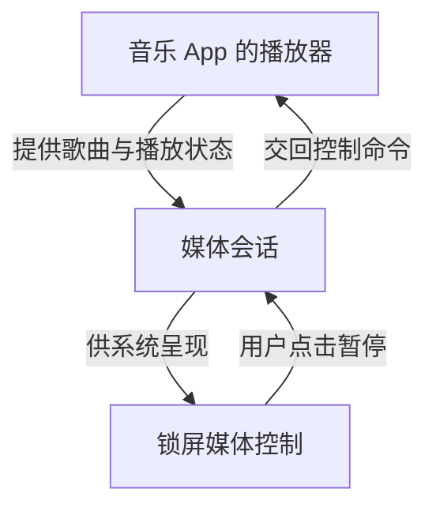
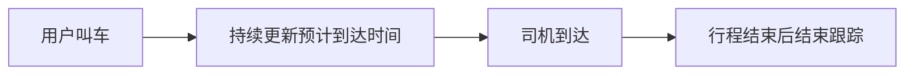

# 06 · 锁屏上的卡片分别是什么能力

[目录](README.md) · 上一章：[与推送一起工作](05-data-and-lifecycle.md)

手机亮屏、还没有解锁时，可能看见会议提醒、音乐封面或外卖进度。它们都像卡片，但不能据此外推成同一个接口。

**锁屏是显示位置，卡片是外观。先看它正在帮用户做什么，再判断对应能力。** 这一章按提醒、控制、跟踪、固定查看和内容轮换分别解释。

## 提醒：告诉用户发生了一件事

上一章的日程 App 发布了“会议改到 15:00”的通知。如果用户允许锁屏显示，系统就可以把它呈现在锁屏上。

这通常不需要另写一张锁屏页面。App 提交通知内容和点击动作，Android 按权限和用户设置决定展示及隐藏哪些内容。[A21](references.md#a21)

因此，**锁屏通知是通知的一种显示位置**。消息来自服务器时可能需要推送；由本地事件触发时，则不一定经过网络。

## 控制：操作正在播放的内容

音乐卡片除了显示曲名，还能暂停、继续或切歌。系统需要知道当前播放状态，并能把按钮操作交回播放器。

这条连接叫 **MediaSession，媒体会话**：音乐 App 提供媒体信息、状态和可用命令，锁屏、系统媒体面板、耳机等入口借此控制同一次播放。[A22](references.md#a22)

它与通知机制有交集，例如媒体库可以生成相应播放通知。但它表达的是可控制的播放状态；只在普通通知里写上“暂停”，不足以建立这条连接。

## 跟踪：关注一件事从开始到结束

打车以后，“司机还有 3 分钟到”会继续变成“司机已到达”。用户关注同一个任务的状态，所以应更新这件事的显示，而不是每次都当作无关的新消息。

普通通知本身就可以更新。进行中通知进一步表达“这件事还在进行”，**更新通知并不要求它一定是进行中通知**。

较新 Android 的 **Live Updates** 则为符合条件的当前任务提供更突出的位置，可涉及锁屏、通知列表和状态栏。它建立在通知机制上，不是另一种把消息从服务器送到手机的推送服务。[A23](references.md#a23)

Live Updates 适合用户参与、正在进行且需要持续关注的活动，例如导航、打车、即时配送。系统、用户设置及厂商条件决定是否获得突出展示；它不适合拿来长期占据一个信息或广告区域。

厂商还可能提供“实况”等产品形态，可能衔接标准机制，也可能需要额外接口。具体接入应按品牌和版本核对。苹果的类似体验叫 Live Activities，使用 ActivityKit，属于另一套平台能力；详细对照和 Android 版本条件放在[接口笔记](native-api-notes.md#lock-screen)。

## 固定查看：留一块天气或日程区域

如果用户能选择某个 App 的组件并把它固定到锁屏，这可能是**锁屏小组件**。分工与桌面小组件相近，只是承载内容的宿主换成了锁屏里的相关界面。[A15](references.md#a15)

手机必须先提供这样的宿主与添加入口。桌面上能添加小组件，不保证锁屏也能添加。

如果天气区域只能在厂商主题中配置，或者本来就是系统固定显示的内容，它也可能是厂商内置功能。系统自己能显示某个区域，不代表第三方 App 有相同的公开入口。

## 内容轮换：亮屏时换图片或资讯

锁屏画报、杂志和主题通常由厂商的锁屏内容产品组织。它们可以轮换背景、标题和推荐内容，具体取决于该产品。

只想提供变化的背景，可以研究动态壁纸；想进入画报的资讯或推荐区域，则需要查厂商是否开放主题制作或内容接入。当前没有确认一个能跨厂商使用的统一接口。

## 用一张表重新区分

| 用户的主要需要 | 优先研究的能力 |
|---|---|
| 知道会议改期了 | 通知及其锁屏展示 |
| 暂停当前歌曲 | 媒体会话与系统媒体控制 |
| 跟踪司机何时到达 | 可更新的通知、Live Updates 或适用的厂商能力 |
| 固定查看下一场会议 | 支持设备上的锁屏小组件 |
| 每次亮屏看不同图片与资讯 | 壁纸或厂商锁屏内容产品，按具体效果区分 |

这不是互斥的技术分类。同一首歌可以既有桌面小组件，又有锁屏媒体控制；同一场会议也可以既有日程组件，又有改期通知。区别在于本次要提供的功能及其系统接入方式。

## 亮屏、解锁和显示内容是三件事

亮屏时看见卡片，可能只是系统把早已保存的内容显示出来，不代表 App 刚刚被唤醒并联网。点卡片进入详情时，系统仍可能要求解锁。

抬手亮屏、双击亮屏、通知是否点亮屏幕属于另外的系统行为。普通 App 不能从“可以发布通知”推导出“可以每次强制唤醒并覆盖锁屏”。来电、闹钟的全屏通知另有适用条件。[A21](references.md#a21)

至此，主屏幕与锁屏可以放回同一条思路：先选要提供的体验，再找到承载它的系统能力，最后核对目标手机与更新方式。若想检查是否已经分清，可做[学习记录里的小练习](learning-notes.md#理解练习)。
