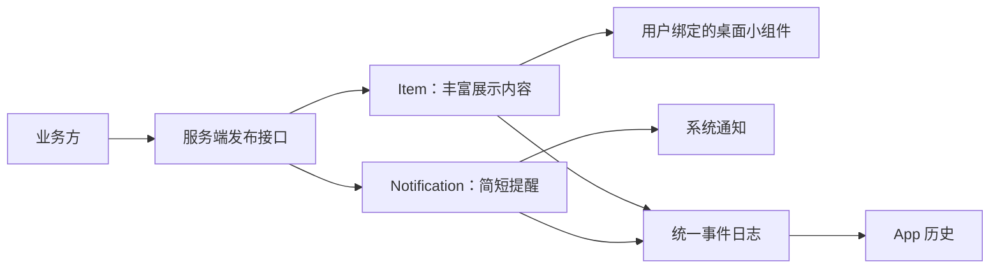

# 数据模型：两类内容，一套同步

[设计目录](README.md) · [数据契约](../../protocol/schemas/core.schema.json) · [发布示例](../../examples/protocol/README.md)

v0.2 已实现通知与展示条目拆分。理解时先区分“提醒一次”和“持续展示”。

| 对象 | 负责什么 | 例子 |
|---|---|---|
| Topic | 权限和订阅范围 | 我的 Agent |
| Item | 持续展示内容，可被小组件绑定 | Agent 总览、今日进度 |
| Notification | 一条简短通知，可更新或清除 | 备份失败、日报完成 |
| Event | 某个资源一次变化的完整记录 | item.upserted、notification.cleared |
| Template | 小组件静态布局与绑定规则 | 文字、指标、进度条 |

Item 和 Notification 是 Topic 下的两类独立资源。一个总览条目可以长期更新，期间产生许多不同通知，也可以完全不发通知。

Item 的 content 包含 title、body、data、可选 template 和 link。title/body 是基础展示回退，模板可以使用结构化 data 展示更多信息。Notification 的 content 只有 title、body 和可选 link，不携带小组件模板；通知正文最多 500 个码点，仍建议只写一两句，系统实际显示多少取决于设备与展开状态。

两类资源都包含 topic_id、id、revision、created_at、updated_at。通知额外包含 mode 和 expires_at。ID 即使相同，也不共享版本、内容或生命周期。更新、删除其中一方不影响另一方，链接也不自动继承。

Notification 的 mode 是 alert 或 silent。alert 在同步时仍有效才有新提醒机会；silent 只更新仍在通知栏的同 ID 通知，不重新弹出被划掉的通知。TTL 决定提醒是否还及时，不决定数据删除时间。

Event 分为 item.upserted、item.deleted、notification.upserted、notification.cleared；携带对应资源 ID、版本及完整内容，删除/清除时内容为 null。历史读取 Event，小组件只读取当前 Item，通知只处理 Notification 事件。用户划掉系统通知不会删除任何服务端数据。

快照分别返回 items 和 notifications；增量按一条统一日志连续分页。Room 分别保存两类当前资源，并在同一个事务中保存同步进度。首次同步、快照恢复和浏览历史都不补弹旧提醒。

具体字段以 Schema 为准，事务、幂等、保留与升级规则见 [协议行为约定](../../protocol/semantics.md)。模板能力见 [模板契约](06-template-contract.md)。
