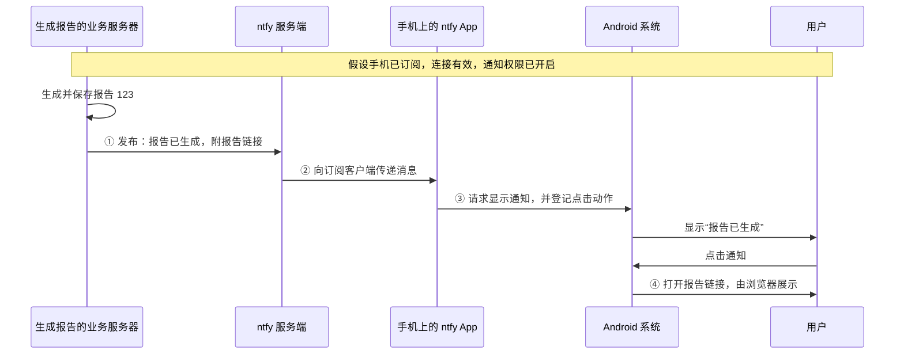

# 01 · 一条通知，从服务器到用户

[学习目录](README.md) · 下一章：[消息如何进入手机](02-connections-and-background.md)

假设你让服务器生成一份报告。任务需要十分钟，你把手机放进口袋。十分钟后，手机出现“报告已生成”；你点一下，就看到了报告。

我们要研究的，就是这件事如何发生。先沿一条完整路径走一遍，再给路径中的各个部分命名。

## 1. 从一条具体路径开始

为了让每个角色都能对应到真实的软件，本章用 **ntfy 服务端 + Android 上的 ntfy App** 举例，并先看客户端直接连接服务端的接收方式。其他接收方式到第二章再展开。



沿着图看，实际有四件依次发生的事：业务服务器**发布**消息，ntfy 服务端把消息**送到客户端**，客户端请系统**展示**通知，系统在用户点击后**打开**内容。

这四件事可以分别改变。例如点击目标可以从浏览器改成 App 内页面，而消息从服务器进入手机的方式不必因此改变。

下面逐段解释这张图。

## 2. 第一步：业务服务器告诉 ntfy 发生了什么

“生成报告的程序”知道任务什么时候完成，因为任务就是它执行的。完成后，它把报告保存起来，再向 ntfy 发一个普通的 HTTP 请求。

请求里的内容大致如下：

```json
{
  "topic": "reports",
  "title": "报告已生成",
  "message": "点击查看报告 123",
  "click": "https://example.com/reports/123"
}
```

这是 ntfy 的 JSON 发布格式，发送到 ntfy 服务端的根路径。现在只需要理解内容，不需要运行它。[S01](references.md#s01)

`title` 和 `message` 告诉客户端将来显示什么，`click` 指明用户点击后去哪里。这里没有把整份报告塞进去，报告仍保存在业务服务器上。

`topic` 指明消息投给哪个频道。手机之前订阅了 `reports`，ntfy 服务端便能把发到这个频道的消息分发给它。同一个频道也可以有其他订阅者。这就是“发布/订阅”的含义：发布者选择频道，接收者选择要听哪些频道，ntfy 负责把两边接起来。

至此，业务服务器完成了它的通知发布工作。但是，它刚才发的是**到 ntfy 服务端的请求**。手机有没有收到，是后面那一段链路的事情。

## 3. 第二步：ntfy 把消息送到手机

手机上的 ntfy App 已经和服务端建立了一条订阅连接。服务端有新消息，就沿这条连接把数据发回来。客户端读到数据，才知道“报告完成了”。

在这一刻，到达手机的是一段**数据**，不是一张已经绘制好的锁屏卡片。

客户端可以保存这条数据，可以更新消息列表，也可以决定提醒用户。收到数据与显示提醒之间，还需要下一步。

这一段正是移动推送中最难的部分：手机放进口袋后，App 还在运行吗？连接还有效吗？系统是否允许继续使用网络？第二章会集中研究这些问题。此处先把它看成“服务器到客户端”的一条箭头。

## 4. 第三步：App 请操作系统显示通知

通知栏、锁屏和通知声音都由 Android 管理。ntfy App 把标题、正文和点击动作交给 Android，相当于说：“请为我发布这一条通知。”

Android 再根据权限和用户设置决定如何呈现。如果用户允许该类通知响铃，可能出现声音和卡片；如果把它设为安静，可能只出现在通知栏。消息已经到达，不代表一定弹出横幅或发出声音。[S17](references.md#s17)、[S18](references.md#s18)

这里还有一个重要的交接：通知发布后，卡片由系统管理，不需要 App 一直把自己的页面画在屏幕上。用户以后点击卡片时，系统使用 App 事先登记的动作打开目标。

ntfy Android 的这段实现可以在 `NotificationService` 中找到：它构建系统通知，并把点击 URI 绑定到待执行动作上。[S06](references.md#s06)

## 5. 第四步：点击后访问报告

例子里 `click` 是一个 HTTPS 链接。用户点击通知，Android 把链接交给能够处理它的程序。本章假设交给浏览器；实际也可能由关联了该网址的 App 处理。

浏览器随后向业务服务器请求报告正文。这是**另一次内容访问**，与前面把提醒送到手机是不同的请求。

这就解释了两个常见现象：通知里写着“报告已生成”，点开时却仍需要加载；通知可以正常出现，但点进去可能需要登录。通知携带的摘要和链接，不能代替真正读取报告所需的网络与访问权限。

如果希望点击后打开自己的原生详情页，原理也一样：客户端先找到报告 123 的页面，再按需要加载内容。只有“打开目标”的这一段变化了。

## 6. 现在再给这些环节命名

完整走过一遍后，我们可以把最容易混淆的三个词放回各自的位置：

| 词 | 在刚才的例子中具体是什么 | 它与其他部分的关系 |
|---|---|---|
| **消息 Message** | “报告 123 已生成”以及相关字段 | 是在程序之间传递的数据 |
| **推送 Push** | 服务端在有新事件时，把消息传向手机 | 描述消息如何到达，而不是卡片长什么样 |
| **通知 Notification** | Android 展示的“报告已生成”提醒 | 是消息到达后可以产生的一种用户界面 |

它们之间的关系可以读成一句话：**服务端通过推送传来一条消息，设备根据这条消息显示通知。**

这也说明它们不是一一对应的。一条消息可能只更新 App 内的数据，不产生可见提醒；五条消息可以汇总显示为“你有五个任务完成”。

“推送”这个词有时泛指服务器主动传数据，有时专指 FCM、APNs 这样的移动推送服务。阅读文档时看清讨论的是通信方式，还是具体平台产品。第二章会把这两层联系起来。

### 本地通知放在哪里

如果 App 已经知道“明天上午九点提醒开会”，它可以提前把提醒登记给系统，到时由系统触发。这通常称为**本地通知**：不需要等远端服务器在九点钟告诉手机。

报告何时生成则是远端才知道的事情，需要先把新信息传进手机，所以属于**远程通知**场景。

两者最终都可能显示为相似的系统卡片。区别主要在触发信息来自哪里，而不是卡片样式。本地调度的准确时间和权限也有平台规则，此处只需把它放到同一张知识地图上。

## 7. 用同一条路径理解“发送成功”

假设业务服务器向 ntfy 发布消息后，收到了成功响应。它能证明的，是 ntfy 已按接口语义接受或处理了这次发布。它不能凭这个响应看见后续所有事情。

可以沿原图逐步问下去：

| 已知事实 | 后面仍可能发生什么 |
|---|---|
| ntfy 接受了发布 | 手机暂时断网，尚未收到 |
| 手机收到了数据 | 通知设置让它保持安静 |
| 通知已经出现 | 用户还没有注意到 |
| 用户点击了通知 | 报告页面还在加载，或需要登录 |

因此，“已发布”“已接收”“已展示”“已点击”“已读”描述的是不同位置上的事实。以后设计状态和回执时，需要说清楚自己观察到了哪一步。

使用 FCM 或 APNs 时也有同样的区分：平台接受请求，不等于设备已经收到。可靠性细节到第四章再学。[S10](references.md#s10)、[S14](references.md#s14)

## 自测：试着重新画出这条路径

不用背术语，尝试向另一个人解释下面三个变化：

1. 手机收到报告消息，但只更新 App 内列表，不显示卡片。原图中哪一步被省略了？
2. 想把点击目标从浏览器改成自己 App 的报告页，需要改变哪些部分？
3. 服务器发布成功，但手机正在飞行模式。消息走到了哪里，又停在哪里？

<details>
<summary>参考答案</summary>

1. 数据依然从服务端送到客户端，但省略了请求系统显示通知及后续通知点击的路径。
2. 需要传递客户端能理解的目标，并在客户端实现对应的点击处理与页面。消息的送达方式不必因为目标改变而更换。
3. 发布者到 ntfy 的请求成功，ntfy 到手机的传递尚未完成。恢复网络后能否补收，还取决于缓存和恢复机制。

</details>

## 进入下一章

第一章的四个动作是：**发布 → 传递 → 展示 → 打开**。

下一章只展开第二个动作：服务器已经有了消息，它究竟如何进入一部锁屏、可能休眠的手机？

想结合官方资料重读这个例子，可以先看 [ntfy 发布文档 S01](references.md#s01) 与 [订阅文档 S02](references.md#s02)，分别对应箭头①和箭头②。
