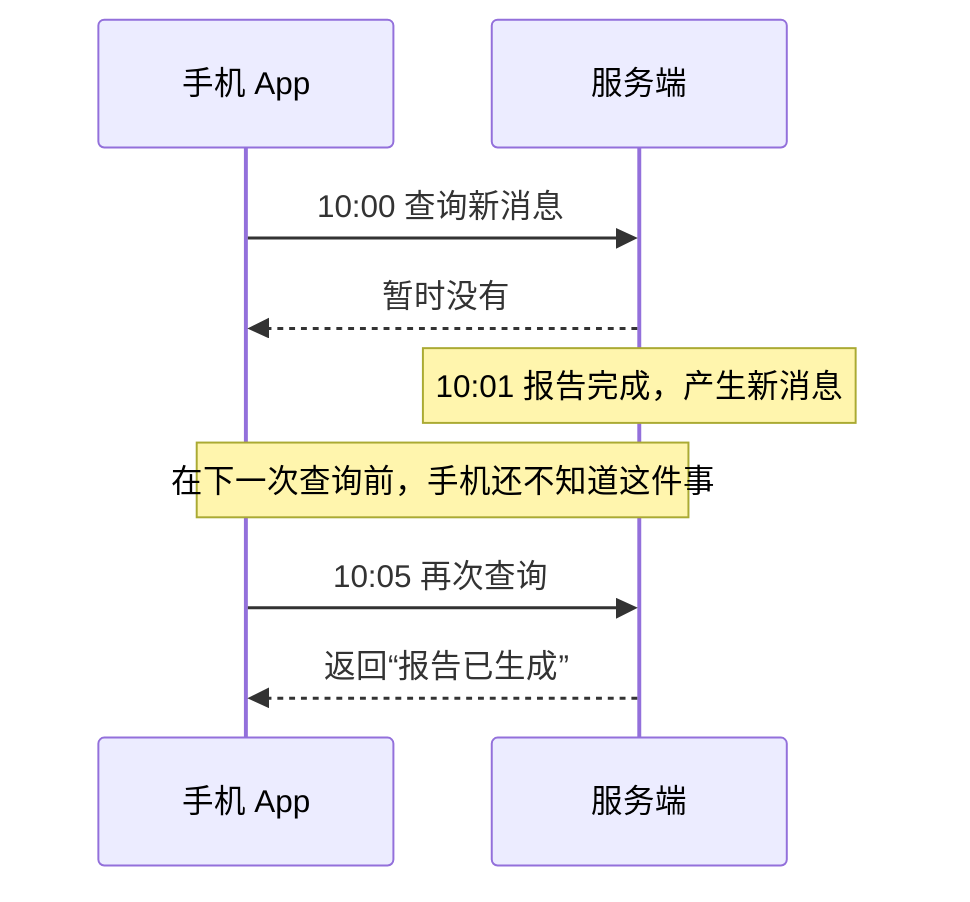
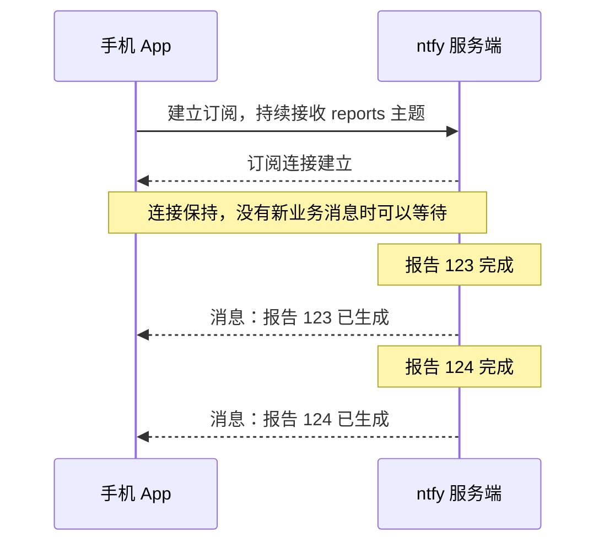
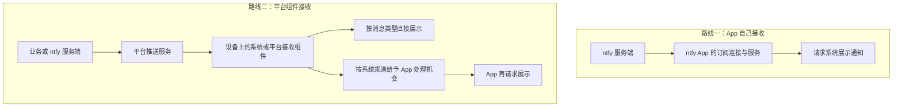

# 02 · 消息如何进入一部锁屏的手机

[学习目录](README.md) · 上一章：[一条通知的完整路径](01-fundamentals.md) · 下一章：[FCM、APNs 与厂商推送](03-platform-push.md)

上一章，我们把通知拆成了“发布 → 传递 → 展示 → 打开”。这一章把镜头停在**传递**：报告服务器已完成任务，ntfy 服务端也已经拿到消息，接下来如何让手机知道？

我们先假设 App 正在运行，再依次加入“减少等待”“网络会断”“手机会休眠”三个现实条件。这样可以看清，每种机制是为了解决哪个问题而出现的。

## 1. 最直接的办法：手机定期来问

客户端已经知道 ntfy 服务端的地址，因此可以发一个请求：“从我上次看到的位置以后，有没有新消息？”服务器有就返回，没有就返回空结果。

假如手机每五分钟问一次，过程可能是这样的：

这叫**轮询 Polling**。消息在 10:01 就准备好了，但客户端到 10:05 才知道，等待来自查询间隔。

把间隔缩短到几秒可以减少等待，却会产生大量“没有新消息”的请求。这些请求增加网络活动；在移动设备上，频繁唤醒处理器或无线通信组件也可能增加耗电。并且，当 App 进入后台，系统未必允许它严格按自己设定的间隔执行。

轮询适合不紧急的更新。若希望事件一发生就尽快知道，我们需要让服务器在两次定时查询之间也有机会发来数据。

## 2. 让手机留下一个正在等待的请求

客户端可以换一种问法：“现在没有消息也没关系，我先等着；有消息再回答。”

服务端暂时不结束这个请求。等报告完成，它马上返回消息。客户端处理完，再发出下一个等待请求。这叫**长轮询 Long polling**。

长轮询已经解决了前面例子的主要延迟：不用等五分钟后的下一次定时查询。有时服务端会先超时返回，客户端再建立新的等待请求。

进一步，可以让服务端在同一次响应中持续发送事件：报告完成时写入一条，另一个任务完成时再写入一条，客户端持续读取。ntfy 提供的 JSON 流和 SSE 就支持这种订阅方式。[S02](references.md#s02)

这里有一个经常让人疑惑的关系：**连接可以由手机发起，而连接上的业务消息由服务器主动发送。** “服务器推送”不意味着服务器必须知道手机的公网地址，然后重新向手机发起一条入站连接。

手机先连上一个可访问的服务器，之后服务器沿已有连接发回数据，就能实现主动通知客户端。手机网络中的 NAT 和防火墙，也使这种由设备发起连接的方式很常见。

## 3. SSE、WebSocket 这些名字处于哪一层

到这里，我们已经知道需要“持续接收事件”。接下来才是选哪种通信机制来承载它。

| 名称 | 在这里承担什么作用 |
|---|---|
| NDJSON 流 | 用一行一个 JSON 对象表达持续返回的事件；ntfy 的 `/json` 使用这种形式 |
| SSE | HTTP 上约定好的服务端事件流，适合服务端持续向客户端发消息 |
| WebSocket | 建立可持续双向通信的连接，双方都可以主动发送消息 |

这些机制对编码、方向和客户端使用方式有不同约定，但它们都位于同一个位置：**承载“服务端 ↔ 客户端”之间的数据通信**。

选择 WebSocket 不会自动解决权限或后台问题，就像换了一种数据格式，也不会让一个已经停止运行的程序开始运行。先把通信层的位置记清，暂时不需要记住每种协议的全部细节。

## 4. 有了连接，为什么还会收不到

现在假设手机已经订阅，服务端一有消息就能发来。要持续做到这一点，至少要同时满足三个条件：

1. **接收方能够执行**：客户端进程或服务还存在，并有机会处理数据。
2. **通信路径可用**：设备有可达网络，连接没有失效。
3. **系统允许相关活动**：当前省电与后台规则允许必要的网络和处理工作。

这三个条件解决的是不同的问题。

你从 Wi-Fi 切换到移动网络时，旧连接可能失效，需要重连。如果中间网络设备清理了空闲连接，客户端需要发现连接已经不可用。心跳和超时常用于检测这种情况；重连后，还可能需要补取断线期间的消息。

但是，如果系统已经回收了 App 进程，心跳代码也不在执行。仅仅缩短心跳间隔，无法让不存在的接收进程继续工作。

因此，**重连处理的是连接失效，后台机制处理的是谁还能继续接收；两者需要配合。**

## 5. 手机为何要限制后台接收

对一个 App 来说，保持连接看起来很合理。如果手机上几十个 App 都持续运行、各自重连、定时心跳和同步，设备就会承担许多重复工作。

操作系统需要控制这些工作的资源消耗。用户离开某个 App 后，它不再天然拥有与前台使用时相同的执行机会。手机长时间空闲时，系统还会进一步限制网络和任务调度。

理解这些限制，首先要分清两个维度：**App 在做什么**，以及**设备处于什么状态**。

| 观察对象 | 需要回答的问题 | 例子 |
|---|---|---|
| App | 页面是否可见？进程是否还在？有没有执行机会？ | 页面退到后台，但接收服务还在；或进程已被系统回收 |
| 设备 | 网络可达吗？是否空闲、锁屏或处于省电限制？ | 手机刚锁屏；或长时间空闲后网络活动受限 |

两个维度可以组合。例如手机刚锁屏时，App 进程可能仍在；一段时间后，进程即使还在，设备也可能进入更严格的省电状态。

Android 的 **Doze** 主要是设备空闲时的省电机制，会影响网络等活动；**App Standby** 则限制较少使用的 App。它们都能影响接收，但不等同于“用户把 App 关了”。[S15](references.md#s15)

同样，系统回收进程、从最近任务列表划走、在系统设置里强行停止，不能统一称作同一种“关闭”。讨论送达效果时必须说清具体动作和设备环境。

## 6. 第一条路线：让 App 持续承担接收工作

如果选择自己维护订阅连接，就需要给这项持续工作找到合适的执行方式。

Android 提供了 **前台服务 Foreground Service**。例如导航时，你切去聊天，导航任务仍继续运行；系统通常通过一条常驻通知，让用户知道该任务正在使用资源。

这里“前台”描述的是服务的执行身份，不要求 App 页面一直显示。它让系统知道这是一项用户可感知的持续工作，而不是普通页面离开后随意继续运行的代码。[S16](references.md#s16)

ntfy Android 的直接订阅采用了前台服务：订阅服务负责维持接收，读到消息后，再请求显示对应的消息通知。[S03](references.md#s03)

这时手机上可能有两类用途不同的通知：

- 常驻通知：“订阅服务正在运行。”它说明接收工作本身仍在进行。
- 消息通知：“报告已生成。”它提醒某一次业务事件。

前台服务使持续接收成为可管理的任务，但不代表系统承诺永不终止。后台启动条件、服务类型、电池优化、网络和厂商规则仍然需要处理。**前台服务本身也不等于免除全部 Doze 限制。**

这条路线把连接和恢复工作主要留给 App。它可以直接连到自建服务，代价是客户端需要承担较多持续运行与适配工作。

## 7. 第二条路线：让平台组件统一接收

另一种安排是：App 不再必须自己一直守着连接，而由手机里与系统深度集成的组件负责接收。不同 App 的消息经过平台服务，按应用身份分发到设备。

看图中的接收方：路线一要求 ntfy 自己维持接收能力；路线二把这件事交给了平台组件。平台可以为多个 App 共享通信资源，减少每个 App 分别维持后台连接的需要。

这就是 FCM、APNs 和厂商推送出现的位置：

- 有相应 Google 服务的 Android，可以通过 Google 的设备通道接收 FCM 消息。
- Apple 设备的普通系统远程通知通过 APNs。
- 相应厂商生态中的设备，也可以使用厂商提供的推送能力。

业务服务器需要把消息提交给平台，因此多了一段转发。但设备侧的接收不再以“自己的 App 一直运行”为前提。[S07](references.md#s07)

注意图中的两个分支。有些消息可以由系统或 SDK 展示，普通 App 进程不必先完成业务处理；有些消息则需要交给 App 处理，系统决定它何时能运行、能运行多久。**平台能接收，不等于 App 获得无限后台执行时间。** 具体区别留到第三章学习。

## 8. 把两条路线放回第一章

第一章中“ntfy 服务端 → 手机客户端”的箭头，现在可以展开成两种不同安排：

| 需要解决的问题 | App 直接接收 | 平台推送接收 |
|---|---|---|
| 谁守着设备侧接收能力 | App 的进程或持续服务 | 系统或平台组件 |
| 服务端向哪里发消息 | 客户端已经建立的订阅连接 | 平台的发送接口 |
| App 不持续运行时如何处理 | 自有连接无法被当作可靠前提 | 平台仍可能接收并展示，或按规则交付 App |
| 谁承担连接与投递维护 | App 与自己的服务端承担较多工作 | 平台承担部分工作，业务仍需处理失败与同步 |

ntfy 同时展示了这两种思路：其 Android 自建服务订阅与 F-Droid 版本使用直接接收；官方 Play 版本连接 `ntfy.sh` 时，还可以使用 FCM 路径。[S03](references.md#s03)

它们不是简单的“HTTP 与 WebSocket 二选一”。那是通信机制的比较；这里讨论的是**把持续接收的责任放在 App，还是放在平台**。

无论选择哪条路线，后面仍然要回到第一章：取得消息、按规则展示，最后在用户点击时打开内容。

## 自测：用原因解释，而不是背名称

1. App 在前台用 WebSocket 收消息很快，锁屏较久后却收不到。为什么不能直接归咎于 WebSocket 协议？
2. 用户切去其他 App，ntfy 仍显示“订阅服务运行中”，之后又出现“报告已生成”。这两条通知分别对应什么？
3. App 进程没有运行，平台仍展示了一条远程通知。这和“进程不在就没法读自己的连接”矛盾吗？

参考答案

1. 前台验证的是连接在当时能工作。锁屏后还需要分别检查进程执行机会、网络连接和省电规则；通信机制本身不能保证这三个条件。
2. 前者说明接收任务在持续运行，后者是该任务收到业务消息后产生的事件提醒。
3. 不矛盾。读取自有连接需要自己的代码执行；平台路径由另一个系统集成组件接收，特定消息可以由系统或 SDK 展示。

## 进入下一章

这章建立了一个因果关系：**希望及时知道远端事件，需要有效的接收路径；手机限制后台活动，因此要安排谁来持续承担接收。**

下一章学习第二条路线的实际接口：App 如何向平台注册、平台如何知道消息属于哪个 App，以及通知消息和数据消息如何交付。

若要核对本章原理，先看 [Android Doze S15](references.md#s15) 和 [前台服务 S16](references.md#s16)，再对照 [ntfy 即时接收 S03](references.md#s03)。具体实机测试条件放在[学习记录](learning-notes.md)，不必在理解原理时同时记住整张测试清单。
