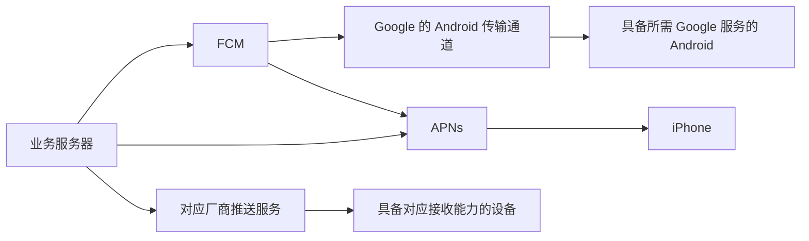
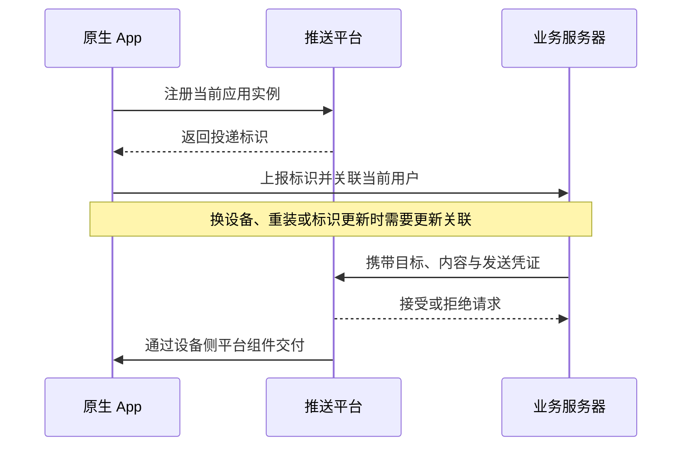

# 03 · FCM、APNs 与厂商推送

[学习目录](README.md) · 上一章：[连接与后台](02-connections-and-background.md) · 下一章：[可靠性](04-reliability-and-sync.md)

## 学习目标

理解平台推送的分工、注册与寻址、应用身份与发送凭证；能区分通知消息和数据消息；知道哪些语义不能跨平台直接照搬。

## 1. 平台全景

| 名称 | 提供者 | 在链路中的作用 | 需要记住的边界 |
|---|---|---|---|
| FCM | Google Firebase | 接收发送请求，支持单应用实例和主题等目标，路由到对应平台 | 在 Android 上依赖可用的 Google 设备服务与网络；在 Apple 平台仍通过 APNs |
| APNs | Apple | 为 Apple 设备提供系统远程推送投递 | 普通 iOS App 的远程通知不能靠自己的永久后台连接替代 |
| 厂商推送 | 华为、小米、OPPO、vivo 等厂商 | 通过对应生态中的设备组件接收并处理推送 | 各自有接入、消息分类与投递规则，不是同一个 API |
| 聚合推送服务 | 第三方服务商 | 整合多个平台的 SDK、发送接口与运营能力 | 仍受底层平台规则约束 |
| ntfy | 开源通知产品 | 将发布 API、订阅、缓存、客户端和部分平台通道组合起来 | 它是完整产品，职责范围与单一设备推送通道不同 |

FCM 架构见 [S07](references.md#s07)，厂商服务的具体例子见华为 Push Kit [S20](references.md#s20)。本轮没有逐家核验全部厂商的接入资格、配额或费用，不应把它们视为一致。

图中的路径是可选关系，不表示一条消息必须同时走所有路径。FCM 到 iPhone 是“FCM → APNs → 设备”，业务服务器也可以直接接 APNs。

## 2. 寻址：投递到哪个 App 实例

传统注册模型中，客户端从平台获得一个 **token**，可理解为“某个 App 在某个设备上的投递地址”。它不是账号、手机号、IP，也不能被当作登录凭证。

APNs 的 device token 与 App 和设备相关。FCM 常见接入使用 registration token；截至本轮查阅，其官方注册管理文档还说明了向 Firebase Installation ID（FID）注册模型过渡、两种模式并行支持的变化。理解上都属于“应用实例的可更新寻址记录”，实际字段应以选用的 SDK/API 为准。[S11](references.md#s11)、[S12](references.md#s12)

此图表达寻址逻辑，最后一步不意味着 App 主进程一定被启动；也可能由系统直接处理展示。

一个用户可以有多个应用实例；同一台手机换账号后，业务服务器还需要正确更新账号关联。退出账号后的投递归属是产品和权限模型的一部分。

## 3. 三种“身份”不要混在一起

| 身份 | 回答的问题 | 例子 |
|---|---|---|
| 应用身份 | 这是哪个 App？ | Android 包名、Apple Bundle ID，以及对应平台配置 |
| 应用实例的投递标识 | 发到哪个安装实例？ | APNs device token、FCM 的注册标识 |
| 服务端发送凭证 | 谁有权替这个应用发送？ | 平台认可的服务端密钥、认证令牌或证书 |

投递标识与发送凭证不等价。拿到一个目标地址，不等于有权代表那个 App 发通知。自行构建 ntfy 客户端时，应用身份和平台项目需要匹配，不能只替换服务端 URL 就假定推送配置仍然适用。

## 4. 单设备投递与主题订阅

| 模型 | 目标由谁描述 | 常见用途 |
|---|---|---|
| 应用实例投递 | 服务端选择一个或多个实例标识 | 个人任务提醒、多设备账号通知 |
| 主题订阅 | 客户端订阅主题，平台维护订阅关系 | 频道广播、共同关注的信息 |

主题不是天然的权限边界。能否发布、订阅以及如何保护私有信息，需要由相应服务和业务规则决定。

ntfy 的 Play 客户端使用 FCM topic 订阅；它的接收源码明确说明自己不直接使用 token 来逐个管理投递目标。[S06](references.md#s06)

另外，**ntfy topic、FCM topic、APNs 的 `apns-topic` 和 Android Notification Channel 不是同一概念**。APNs 的 topic 通常对应应用标识，而 Android Channel 管理通知展示分类。详见[术语表](glossary.md)。

## 5. 通知消息与数据消息

| 模式 | 主要意图 | Android FCM 的典型行为 |
|---|---|---|
| Notification message | 让用户看见标题和正文 | App 在后台时通常由 SDK/平台展示；前台时交由 App 处理行为 |
| Data message | 交给客户端自定义处理 | App 获得允许的回调机会后处理；是否展示由客户端决定 |
| Notification + data | 展示提醒，并带上业务定位信息 | 展示与数据交付的时机受前后台状态影响 |

这是 FCM 的分类，不能把字段名直接复制到 APNs 或所有厂商服务。APNs 有自己的 payload 和 push type 规则。[S08](references.md#s08)、[S14](references.md#s14)

两种常见内容策略：

- **携带足够的展示内容**：设备收到后即可显示标题、摘要；用户打开再取完整内容。
- **只携带“有新消息”的提示**：设备需要额外请求服务器才能拿到正文，增加对网络与后台执行机会的依赖。

ntfy 自建服务的 iOS 路径采用后一类思路，并有通用文案回退；它不能被理解成“静默唤醒永远可靠”。

## 6. 三个相互独立的控制轴

| 控制轴 | 控制什么 | 不保证什么 |
|---|---|---|
| 传输优先级 | 平台尝试何时投递、是否给予部分执行机会 | 不保证响铃或绝对实时 |
| 通知展示重要程度 | 是否有声音、横幅等；受用户设置控制 | 不提高网络投递保证 |
| 后台执行权限与预算 | App 能运行哪些工作、多长时间 | 不代表可以任意常驻 |

FCM high priority、Android Channel importance、ntfy priority 是不同层的概念，映射关系需要查看实现。把消息设为“最高优先级”并不能绕过所有限制。[S09](references.md#s09)、[S17](references.md#s17)

## 7. 内容大小与资源获取

推送 payload 是小消息，不适合直接承载报告文件、长文或视频。FCM 普通消息 payload 的官方限制通常为 4096 字节，特定接口或目标类型可能有更严格限制；其他平台需要分别核对。

实际设计常传标题、摘要、消息 ID 和内容定位信息，大资源通过正常业务接口获取。定位信息本身不会授予内容访问权限，点击后仍需正常鉴权。[S08](references.md#s08)

## 自测

1. 用 FCM 给 iPhone 发通知，是否绕开了 Apple？
2. 一个用户有两台手机，业务系统只保存一个投递标识够吗？
3. 服务器知道报告 ID，为什么还需要目标设备信息？
4. high priority 是否意味着可以在后台持续下载十分钟？

参考答案

1. 没有，Apple 设备的最终系统通道仍是 APNs。
2. 通常不够，要关联多个当前有效的应用实例。
3. 报告 ID 说明“是什么内容”，实例标识或主题说明“发给谁”。
4. 不是。优先级与长时间执行权限是不同概念。

## 官方阅读

按 [FCM 架构 S07](references.md#s07) → [APNs 注册 S12](references.md#s12) → [FCM 消息类型 S08](references.md#s08) 的顺序阅读。厂商具体接入留到确认设备和发行范围之后。
