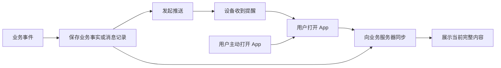
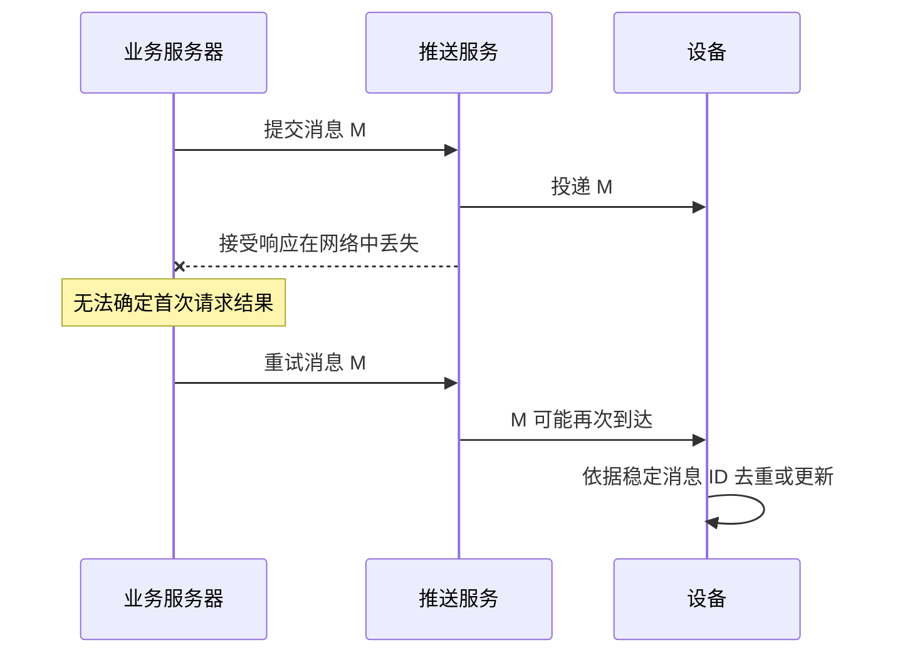

# 04 · 消息可靠性与同步

[学习目录](README.md) · 上一章：[平台推送](03-platform-push.md) · 下一章：[展示与跳转](05-notification-and-navigation.md)

## 学习目标

理解尽力送达、TTL、折叠、重试、幂等、去重和补拉；能区分投递记录与业务消息；知道怎样描述和观察可靠性。

## 1. 先假设链路会中断

通知链路包含业务服务器、推送服务、互联网、手机系统和 App。任何环节都可能暂时失败。

FCM 接受请求不代表设备收到；APNs 明确采用 best-effort 语义，消息可能延迟、重排、限流或不送达。[S10](references.md#s10)、[S14](references.md#s14)

因此需要两个互补机制：

- **及时提醒**：有机会时尽快让用户知道发生了什么。
- **数据同步**：用户回来时能够获得完整、当前有效的内容。

即使推送路径中断，用户主动打开 App 后仍能同步。这里的“业务服务器”可以很简单，图不要求复杂分布式系统。

## 2. 四个不同的时间

| 时间或期限 | 含义 | 示例 |
|---|---|---|
| 事件发生时间 | 业务事实何时产生 | 10:00 报告生成 |
| 推送 TTL / 到期时间 | 推送平台还应尝试投递多久 | 最多尝试一小时 |
| 消息历史保留时间 | 服务端允许补查消息多久 | 历史保存三十天 |
| 业务资源有效期 | 目标内容或动作何时失效 | 下载链接一小时后失效 |

这些数值不能混为一谈。TTL 不是“保证多久内到达”；推送过期也不一定意味着报告需要删除。数字只是教学示例。

过期处理因平台不同。FCM 的 TTL 为零表示无法立即交付就丢弃；APNs 的相应语义通过自己的头字段表达，不能直接套用 FCM 字段。[S10](references.md#s10)、[S14](references.md#s14)

## 3. 事件与状态决定是否可合并

| 消息 | 类型 | 如何看待旧消息 |
|---|---|---|
| 温度变成 25、26、27 度 | 最新状态 | 通常只需最新值 |
| 同一任务进度 10%、50%、100% | 最新状态 | 通常可以按任务合并 |
| 三笔不同订单付款成功 | 独立事件 | 每笔都需要有业务记录 |
| 有未读内容，计数由 2 变成 5 | 汇总状态 | 可以以最新汇总替换旧汇总 |

**Collapse（折叠）**一般指在特定投递条件下，用新消息替代某些待投递旧消息。**通知分组**是界面呈现方式。**用同一个通知 ID 更新卡片**又是客户端展示行为。这三者并不相同。

不能要求平台推送队列成为无损事件日志。即便业务上每笔事件都重要，也应依靠业务存储和同步保证可查。

## 4. 重试为什么会制造重复

超时有两种可能：“根本没处理”或“处理了但响应丢了”。如果一超时就创建一个全新消息，重复通知会更难处理。

需要区分：

| 概念 | 主要解决什么 |
|---|---|
| 请求幂等键 | 同一业务发布请求重试时，不重复创建业务消息 |
| 业务消息 ID | 多个投递尝试都指向同一条业务消息 |
| 投递尝试 ID | 跟踪某次向某个平台、某个实例发送的操作 |
| 客户端去重 | 同一消息重复到达时，不重复入库或提醒 |

自建入口可以设计幂等，但不能假定所有推送平台或 ntfy 发布 API 都原生提供相同的幂等保证。教学中的 ID 与字段不是已确定的产品 Schema。

## 5. 乱序与版本

任务“完成”先到，“进行中”后到，并不意味着任务真的重新开始了。

对于状态消息，可使用业务版本判断新旧，或收到提示后直接获取最新状态。不同设备的本地时钟可能不一致，因此不要仅凭接收时间决定业务顺序。

对于独立事件，使用稳定 ID、服务端排序或游标同步；用户需要的是完整事实，不是推送恰好到达的顺序。

## 6. 断线补拉与缺口

常见做法是记录最后处理的位置，再请求“从这个位置之后的消息”。这个位置可以是服务端游标、消息 ID 或其他可恢复标记。

只有服务端还保留对应历史时，增量恢复才可能完整。缓存过期、游标失效、响应截断，都可能产生缺口，需要明确的重新同步路径。

ntfy 支持 `since` 和 `poll=1`，用于读取保留范围内的消息。其服务端默认缓存不能被理解为无限历史或完整业务数据库。[S02](references.md#s02)、[S04](references.md#s04)

## 7. 错误如何分类

| 情况 | 常见处理方向 |
|---|---|
| 网络超时、部分服务端暂时错误 | 有限重试，指数退避，加入随机抖动 |
| 平台限流 | 遵守平台的重试提示，降低速率 |
| 内容格式错误、发送权限错误 | 修正请求或配置，不能盲目重试 |
| 明确的失效注册标识 | 按平台语义停用该投递记录，等待重新注册 |
| 用户关闭通知展示 | 在合适界面解释设置状态；不停重发不能解决 |
| 消息已过期 | 停止投递；业务记录是否保留另行决定 |

具体错误码必须按平台解释。例如不能把所有“参数无效”都当作设备地址失效。

## 8. 可观测性：每条记录都要说清范围

最小的学习性排查记录包括：消息 ID、通道、设备测试标识、发布时刻、平台接受时刻、可观测接收时刻、通知发布时刻、点击时刻与错误原因。

| 指标 | 必须说明的口径 |
|---|---|
| 平台接受率 | 分母是请求次数还是去重后的消息？ |
| 设备接收率 | 有哪些设备和消息类型能上报回执？缺失是否未知？ |
| 接收延迟 | 从业务事件还是平台接受开始计算？两端时钟是否可比？ |
| 点击率 | 分母是发送、送达还是可见通知？ |

平台代理展示、后台限制和离线上报可能使统计延迟或缺失。没有回执不自动等于未送达，也不能自动算送达。[S09](references.md#s09)

## 自测

1. 门铃提醒和每月账单应该使用完全相同的 TTL 吗？
2. 服务器发送超时，为什么不能断言手机没收到？
3. App 离线三天，ntfy 服务端只保留十二小时，`since` 能找回全部消息吗？
4. 同一条消息走两个通道，怎样避免提醒两次？

参考答案

1. 通常不应，业务时效不同，参数由产品需求决定。
2. 可能平台已处理、设备已收到，只是响应丢失。
3. 不能。已过保留期的数据无法凭游标恢复。
4. 各通道保留相同业务消息身份，在具备客户端处理能力的路径中去重或更新同一卡片。系统自动展示路径还需单独设计协调，不能只依赖客户端数据库去重。

## 官方阅读

[FCM 生命周期 S10](references.md#s10) 与 [APNs 请求及投递语义 S14](references.md#s14) 对照阅读，重点关注过期、存储和可能丢失的条件。
