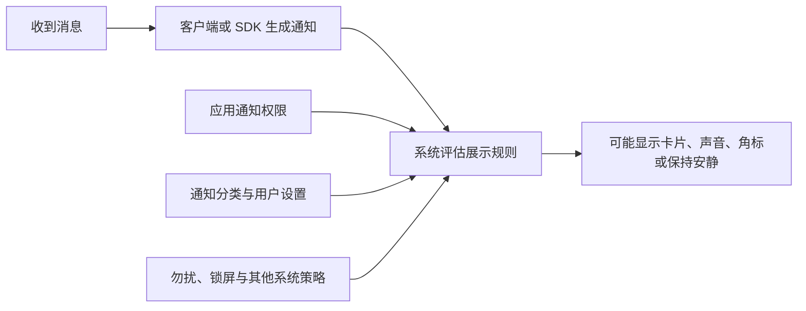
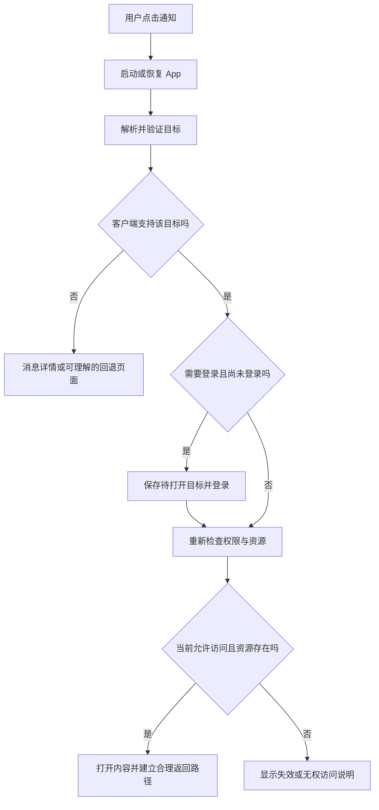

# 05 · 通知展示与点击跳转

[学习目录](README.md) · 上一章：[可靠性](04-reliability-and-sync.md) · 下一章：[ntfy 案例](06-ntfy-case-study.md)

## 学习目标

区分送达与展示；理解 Android 通知权限和 Channel；理解内部路由、深链接和网页入口；能说明冷启动、登录和资源失效对点击的影响。

## 1. 通知是系统管理的交互界面

服务器传来标题、正文和优先级，并不意味着它能最终决定声音、横幅或锁屏行为。

展示条件不允许时，数据仍可能在某些链路中到达；但不得据此推断所有通道在关闭通知权限后都保持同样行为。平台和厂商策略需要分别确认。

## 2. Android 必须理解的两项机制

### 通知权限

Android 13 及以上，普通通知涉及运行时 `POST_NOTIFICATIONS` 权限。请求时机、目标 SDK、升级安装和例外场景按官方规则处理。

权限最好在用户理解用途后请求，例如订阅一个频道时。用户拒绝后，应能在 App 内看清当前状态，而不是承诺“已经开启通知”。[S18](references.md#s18)

### Notification Channel

Android 8.0 引入通知 Channel，用于管理某类通知的视觉、声音和重要程度。用户可以分别关闭或调整它们。

例如“任务结果”“普通更新”可以是不同分类。通常应按用户可理解的用途划分，不应为每条消息创建一个新分类。

创建后，App 不能随意重写该 Channel 的重要程度来覆盖用户选择；名称和描述等部分信息仍可调整。[S17](references.md#s17)

| 名称 | 主要管理什么 |
|---|---|
| ntfy topic | 订阅哪一组消息 |
| FCM topic | 平台维护的一组订阅实例 |
| Android Notification Channel | 这一类提醒怎样展示 |
| 通知分组 Group | 多张卡片如何在界面中归组 |

## 3. 三类点击目标

| 目标 | 谁负责解析 | 典型实现思路 |
|---|---|---|
| 自己 App 内的页面 | 自己的客户端 | 明确路由名称或本地导航目标，加业务参数 |
| 网页 | 浏览器或系统关联的 App | HTTPS URL，可使用浏览器或 Custom Tabs |
| 其他 App 的页面 | 目标 App 和系统 | 目标已支持的 URL 或 URI scheme |

协议可以选择客户端已经实现的页面并传参，不能仅凭服务器发来一个字符串，就让原生 App 获得从未实现的新页面。

内部点击不必暴露为公共 URL：Android 可用明确指向自己 Activity 的 Intent，再由客户端解析业务路由。外部入口才需要考虑 App Links 或其他深链接机制。

## 4. 深链接、App Links 与 URI scheme

- **深链接 Deep link**：指向具体内容或功能的入口，是总称。
- **自定义 URI scheme**：例如 `exampleapp://reports/123`；由安装的 App 声明处理，可能没有处理者，也不自带域名归属验证。
- **Android App Links**：通过网站与 App 的可信关联，验证某些 HTTPS 链接由自己的 App 处理。验证和运行条件需要实际测试。
- **普通 HTTPS 链接**：通常可以由浏览器访问；若有有效 App 关联，也可能直接打开 App。

想“强制在浏览器打开”和“允许系统选择已关联 App”是不同产品行为，不能只看链接是 HTTPS 就认定一定开浏览器。[S19](references.md#s19)

## 5. Android 如何把动作绑定到通知

通知的点击通常通过 **PendingIntent** 交给系统：它描述“用户点击时，执行这个预先指定的动作”。系统可以在 App 页面不在前台时使用它。

自己的 App 页面可使用明确 Activity 入口，并处理返回栈。ntfy 的外部 `click` 则通过 `Intent.ACTION_VIEW` 将 URI 交给系统解析。[S06](references.md#s06)、[S21](references.md#s21)

需要正确区分多条通知的 PendingIntent 身份和参数更新规则，避免点击报告 A 却打开报告 B。不要把所有通知都绑定到一个会意外覆盖内容的待执行动作。

## 6. 冷启动、登录和回退

通知创建时与点击时可能相隔数天。内容可能被删除、账号可能切换、访问权限可能变化。链接携带的资源 ID 只负责定位，不自动授予权限。

“返回”也需要设计：从锁屏进入详情后，返回到 App 列表、浏览器还是桌面，取决于入口和任务栈。不能只测试 App 已打开时的跳转。

## 7. 展示与操作的边界

第一阶段理解“打开页面”即可。通知按钮还可能执行 HTTP 请求、标记已读或其他动作，这些行为与普通导航不同。

例如“查看报告”是读取入口，而“删除报告”是状态变更；后者需要正确的身份、业务授权、幂等和必要的交互确认。ntfy 提供某种动作能力，不代表产品应该默认暴露所有动作。

## 自测

1. 传输优先级设为最高，能覆盖用户把通知分类静音的选择吗？
2. 一个 HTTPS 链接是否一定打开浏览器？
3. 用户点击三天前的消息，需要重新检查资源权限吗？
4. App 内打开自己的详情页，是否一定要注册自定义 scheme？

参考答案

1. 不能。传输与展示是不同层，用户设置参与决定展示。
2. 不一定，系统可能交给已关联 App。
3. 需要，业务权限和资源状态可能已变化。
4. 不必。内部通知可以使用明确的本地入口与路由；公开深链接是另一项能力。

## 官方阅读

[通知权限 S18](references.md#s18) → [Channel S17](references.md#s17) → [通知导航 S21](references.md#s21)。最后再读 [App Links S19](references.md#s19)，避免把全部导航问题都归为深链接问题。
