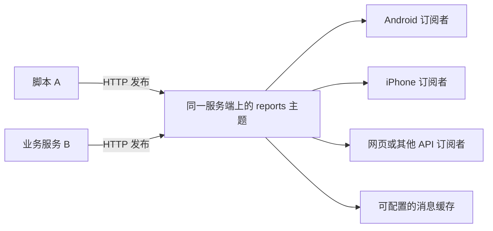
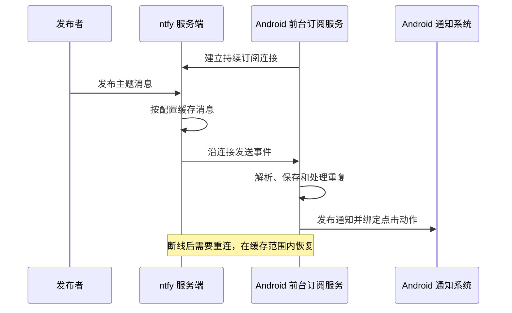
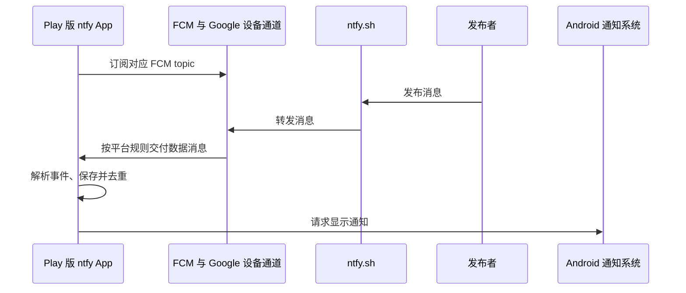
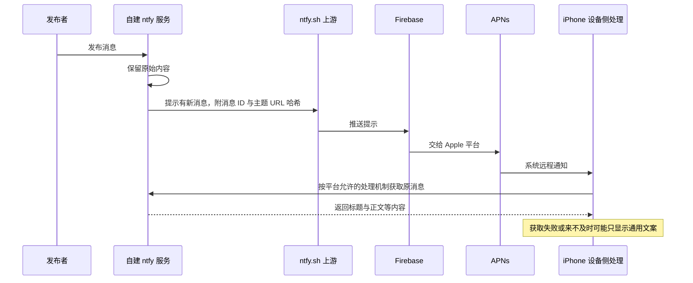

# 06 · ntfy 的完整实现案例

[学习目录](README.md) · 上一章：[展示与跳转](05-notification-and-navigation.md) · 练习：[学习记录](learning-notes.md)

## 学习目标

用前五章的概念读懂 ntfy：发布/订阅模型、服务端缓存、Android 的两种接收方式、iOS 的上游提示机制和通知点击实现。

本章基于官方文档与源码阅读，没有在目标手机上做过实机验证。平台文档用于解释约束，ntfy 源码用于确认具体实现。研究日期与固定版本见 [S05](references.md#s05)、[S06](references.md#s06)。

## 1. 它是什么

ntfy 是一个开源通知产品，组合了 HTTP 发布接口、主题订阅、缓存、自托管服务和客户端。

它允许脚本或业务服务发送通知，而发送方无需自己处理手机注册、通知 UI 或每个客户端的连接。

服务端主要采用 Go；Android 客户端是 Kotlin 原生实现，本次查阅的客户端主要使用 Android Views、AndroidX、Room 等。不能把“原生 Android”误写成“该项目已经使用 Jetpack Compose”。服务端与 Android 客户端的许可证均为 Apache 2.0，复用时仍需遵守各项目和依赖的条款。[S05](references.md#s05)、[S06](references.md#s06)

## 2. 发布与订阅



主题是频道名。`ntfy.sh/reports` 和 `ntfy.example.com/reports` 是不同服务端上的不同订阅目标；只知道主题短名还不足以确定完整身份。

默认开放配置允许匿名读写主题；私有部署可启用认证、topic ACL 和默认拒绝访问。随机主题名能降低被猜中的概率，但不能代替明确的身份与权限设计。[S01](references.md#s01)、[S04](references.md#s04)

两种常见发布格式：

```http
POST /reports HTTP/1.1
Host: ntfy.example.com
Title: Report ready
Click: https://example.com/reports/123

Report 123 has been generated.
```

或者向服务端**根路径**发布 JSON：

```http
POST / HTTP/1.1
Host: ntfy.example.com
Content-Type: application/json

{
  "topic": "reports",
  "title": "报告已生成",
  "message": "点击查看报告 123",
  "click": "https://example.com/reports/123"
}
```

以上是文档示例，没有实际发送。认证头是否必需取决于服务端访问控制。JSON 发布目标是根路径，而不是 `/reports`。[S01](references.md#s01)

## 3. 服务端与客户端字段

| 字段或配置 | 作用 |
|---|---|
| `topic` | 消息所属主题 |
| `title`、`message` | 展示内容 |
| `id`、`time`、`event` | 接收事件的身份、时间与类型等信息 |
| `sequence_id` | 把多次消息关联为同一组连续更新；不等于每次事件的独立 ID |
| `click` | 通知主体点击时打开的 URI |
| `actions` | 额外按钮，如打开链接或发送 HTTP 请求 |
| `priority` | ntfy 的消息优先级，由各端映射处理 |
| `since` | 读取缓存时指定恢复起点 |

发布请求与接收事件的 Schema 并不完全相同。不能假定向发布 JSON 随意添加字段后，服务端就会把它们完整透传给每个平台。设计自有协议时，应单独确认字段映射、编码和长度限制。

## 4. Android 路径一：直接订阅



官方称之为 instant delivery。Android 客户端用前台服务维持订阅，通常伴随常驻通知。服务端提供 JSON 流、SSE 和 WebSocket；客户端源码有 JSON 与 WebSocket 连接实现。

本次查阅的 `SubscriberService` 源码还处理了前台服务启动失败、无网络等待、重连和启动恢复等情况。它体现了移动端持续连接的维护成本。[S02](references.md#s02)、[S03](references.md#s03)、[S06](references.md#s06)

官方 Android 客户端连接自建服务时使用这类接收方式；F-Droid 版本不包含 Firebase，所有订阅默认走直接接收。

“即时接收”是产品功能名，不是所有 ROM、后台状态和网络条件下的实时送达保证。电池优化设置、前台服务限制和用户停止行为仍然重要。

## 5. Android 路径二：FCM



官方文档明确：Play 版客户端只为主站 `ntfy.sh` 使用 Firebase；自建服务器不会因为客户端安装自 Play 商店就自动获得这条链路。[S03](references.md#s03)

源码确认：

- `FirebaseMessenger` 使用 `subscribeToTopic` 和 `unsubscribeFromTopic`。
- `FirebaseService` 处理数据消息，按事件类型分流。
- 收到普通消息后构造本地通知记录，保存成功后再分发展示。
- 部分截断消息、轮询提示等有单独处理，不能假设每条 FCM payload 都是完整业务内容。

官方允许为自建服务配置自己的 Firebase 项目，但需要配套构建客户端。应区分“标准客户端的默认能力”与“修改客户端后可实现的能力”。[S04](references.md#s04)、[S06](references.md#s06)

直接接收与 FCM 在部分配置下可能并存。多路径也解释了稳定消息身份和本地去重的重要性。

## 6. 自建服务的 iPhone 路径



自建服务通过 `upstream-base-url` 配置上游。标准方案使用 `https://ntfy.sh`，上游转发的是提示信息，不是原始标题和正文。

这减少了通过上游传递的正文内容，但仍存在消息 ID、主题 URL 哈希等元数据以及外部投递依赖。不能把它表述为已经实现端到端加密。

设备侧随后取正文，意味着通知完整内容还依赖自建服务可达性和有限处理时间。官方说明取不到时可能显示 `New message`。[S04](references.md#s04)

这张图依据 ntfy 的服务端与官方文档描述，不是本轮对 iOS 客户端每个执行入口的源码审计。也不意味着可以依靠无限可靠的静默后台唤醒。

如果构建自己的 iOS 客户端和后端，可以替换官方上游；普通系统远程推送仍需要 APNs。不能因为内容服务自建就推导出整个 iOS 投递链路完全自建。

## 7. 三条路径的比较

| 维度 | Android 直接订阅 | Android 官方 FCM 路径 | 自建 ntfy + 官方 iOS 路径 |
|---|---|---|---|
| 设备侧接收基础 | App 的持续订阅服务 | Google 设备通道与客户端 | APNs 与设备侧通知处理 |
| 主体网络路径 | 自建或公共 ntfy → App | ntfy.sh → FCM → Android | 自建 → 上游 → Firebase → APNs → iPhone |
| 是否依赖客户端持续连接 | 是 | 不以自有持续连接为前提 | 不依赖普通 App 永久后台连接 |
| 原消息如何取得 | 订阅流；离线后补拉 | FCM 数据，部分情况需其他处理 | 从自建服务器拉取 |
| 主要边界 | 后台、省电、连接与恢复 | Google 服务可用性、平台规则 | APNs、上游、取正文时间与服务可达性 |

表中是指定场景，不能外推为所有定制 ntfy 客户端的能力。

## 8. 缓存与恢复

本次官方默认配置中，消息内存缓存为 12 小时，进程重启后丢失。可以配置 SQLite 文件或官方支持的数据库配置以持久化，也可以修改保留时间或关闭缓存。托管服务的实际配置应另查，不能直接套用默认值。

示例读取路径：

```text
GET /reports/json
GET /reports/json?since=last-message-id
GET /reports/json?poll=1&since=last-message-id
```

第一条持续订阅；第二条从指定位置恢复并继续订阅；第三条读取缓存后结束请求。`last-message-id` 是占位符。

恢复受缓存保留范围和服务端限制影响。本次文档还描述了缓存重放大小上限及截断标记，因此“请求成功”也不一定表示获得全部历史。[S02](references.md#s02)、[S04](references.md#s04)

## 9. 点击跳转实际如何实现

Android 的 `NotificationService.setClickAction` 中：

1. `click` 为空时，绑定 ntfy 自己的订阅详情入口。
2. 有 `click` 时，将其解析为 URI。
3. 使用 `Intent.ACTION_VIEW` 构造 `PendingIntent`，绑定到通知。

系统在点击时决定由浏览器还是某个 App 处理。目标 App 必须已实现并注册相应入口；不能通过 ntfy 打开其他 App 任意私有页面。

客户端存在部分异常处理，但不能据此声称每一种“没有处理该 URI 的 App”的情况都有完善回退。完善自有产品时仍需检查点击时失败路径。[S06](references.md#s06)

## 10. 连续更新、清除与模板（补充查阅）

同一固定版本的发布文档还定义了 `sequence_id`：业务方可向 `/<topic>/<sequence_id>` 连续发布，或通过 `X-Sequence-ID` 等入口提供同一标识。每次消息仍有独立 ID，客户端据序列身份处理连续更新。文档以“下载中 → 下载 50% → 完成”为例。[S01](references.md#s01)

清除与删除的含义也不同：`clear` / `read` 发出 `message_clear`，用于标为已读、从通知栏移除；DELETE 发出 `message_delete`，用于从通知栏及客户端数据库移除。不能把用户清除系统通知、业务内容删除和消息缓存过期混为一谈。

ntfy 的 message templating 使用 Go template，在服务端把输入 JSON 转成标题、正文、优先级等字段。它不等于手机上的原生布局模板。我们的产品另行设计小组件模板，详见 [协议对照](../product-design/05-ntfy-protocol-decisions.md)。

以上来自 2026-09-08 对固定版本文档与服务端入口的补充阅读，不是 Android 或 iOS 各版本行为的实机保证。

## 11. 可以借鉴的点与仍待决定的点

| 已观察到的设计 | 学习价值 |
|---|---|
| 简洁 HTTP 发布入口 | 发送方易于集成 |
| 主题发布/订阅 | 解耦发布者与接收者 |
| 点击 URI 作为数据 | 传输机制不必理解页面业务 |
| 多种接收路径 | 统一发布 API 可以适配平台差异 |
| 缓存与恢复参数 | 正面处理短时断网 |
| 本地保存和去重 | 多路径、重连下避免重复处理 |

这不代表已经决定采用 ntfy。要做自己的产品，还需讨论消息权限、历史保存、路由兼容、设备覆盖、可接受延迟与实际维护成本。

## 自测

1. 给自建服务器配好 Firebase 后，官方 Play 客户端是否自动使用它？
2. F-Droid 版为什么还可以接收消息？
3. 自建 ntfy 的 iPhone 方案是否完全绕过了 Apple？
4. `click` 由服务端还是手机系统真正执行？

<details>
<summary>参考答案</summary>

1. 不会，需要配套配置和构建客户端。
2. 它通过前台服务维持直接订阅，不依赖 Firebase。
3. 没有，普通系统远程推送仍经过 APNs。
4. 服务端传递数据；客户端绑定动作；用户点击后由设备系统和对应 App 执行。

</details>
