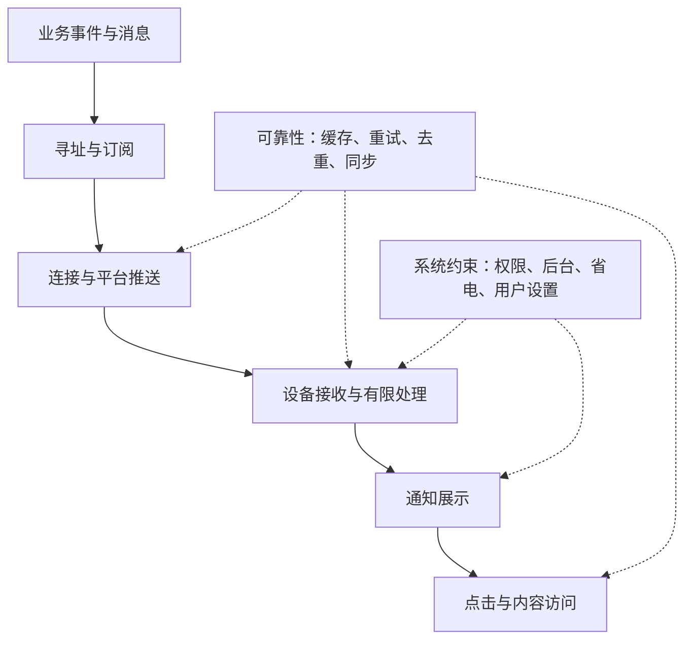

# 移动推送通知学习手册

这套文档帮助我们理解：一条服务器消息，如何穿过网络和操作系统，成为手机上的通知，并在点击后打开正确的内容。

以原生 Android 为主要学习对象，对照 Apple 平台，并用开源项目 **ntfy** 解释实际实现。先建立领域知识，再讨论产品与协议设计。

整理日期：**2026-09-08**。平台规则可能随操作系统、SDK、推送服务和厂商政策变化；涉及具体接入时，应重新核对官方资料。源码研究基线见[参考资料](references.md)。

## 如何使用

按顺序学习下面六章。每章包含学习目标、图表、例子、自测题与参考答案。时间是阅读和思考的粗略估计，不是学习进度要求。

| 顺序 | 内容 | 学完应能回答 | 建议时间 |
|---|---|---|---|
| 1 | [一条通知，从服务器到用户](01-fundamentals.md) | 发布、传递、展示和打开怎样接成一条路径？消息、推送、通知分别在哪里？ | 15 分钟 |
| 2 | [消息如何进入一部锁屏的手机](02-connections-and-background.md) | 从轮询到持续连接，再到平台推送，各自在解决哪个问题？ | 20 分钟 |
| 3 | [FCM、APNs 与厂商推送](03-platform-push.md) | 设备如何注册？推送如何找到某个 App？ | 25 分钟 |
| 4 | [消息可靠性与同步](04-reliability-and-sync.md) | 离线、重复、乱序、过期和回执怎么理解？ | 25 分钟 |
| 5 | [通知展示与点击跳转](05-notification-and-navigation.md) | 收到消息后如何提醒？点击如何到达页面？ | 20 分钟 |
| 6 | [ntfy 的完整实现案例](06-ntfy-case-study.md) | ntfy 如何把统一 API 接到不同送达机制？ | 30 分钟 |

辅助材料：

- [术语表](glossary.md)：遇到生词时查阅，也可以用于复习。
- [学习记录与练习](learning-notes.md)：记录理解、疑问和未来实机观察。
- [官方文档与源码索引](references.md)：每章中的 S 编号都指向这里。

前两章用“服务器生成报告，手机收到提醒，点击查看报告”作为同一个例子。第一章建立完整路径，第二章只展开其中的消息传递环节；之后再分别深入平台接口、可靠性和交互。

## 知识地图

这张图的主线是“数据如何到达人”。虚线表示横跨多个环节的约束：可靠性不能只靠重试解决，通知体验也不能只由服务器决定。

## 当前背景与讨论边界

已经明确的产品意图：

- 希望有一个通用、简洁的移动 App，可接收通知并按配置跳转。
- 第一端是 Android；各平台使用各自原生技术，不使用 React Native 或 Flutter。
- 点击目标可以是网页，也可以是 App 内已经实现的入口。
- 初期以个人使用、小范围验证为背景。
- 当前任务是学习和调研，尚未选择最终推送方案。

尚未决定：

- 直接使用、修改 ntfy，还是自行实现客户端与服务端。
- 公共服务、自建服务，以及平台推送的组合方式。
- 身份、订阅权限、历史消息保存和跨设备已读模型。
- 自己的 API、消息 Schema、路由格式和可靠性目标。

本文中的示例字段、流程和实验均用于学习，不代表已冻结的产品协议，也不代表实验已经执行。

## 阅读时始终区分四件事

1. **业务消息与通知卡片**：前者记录事实，后者提醒用户。
2. **平台接受请求与设备收到消息**：中间还有网络与系统调度。
3. **通知可展示与 App 可执行代码**：后台处理能力不是无限的。
4. **学习中的统一概念与平台实际语义**：不同平台的 TTL、折叠、优先级和回执不能机械等同。

图示采用 Mermaid，支持 Mermaid 的 Markdown 阅读器可直接渲染。每幅图也配有文字解释或表格，便于在只显示文本的环境中阅读。
