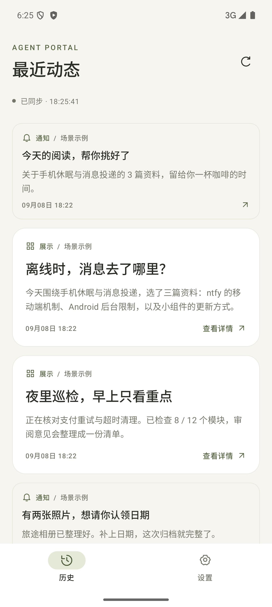
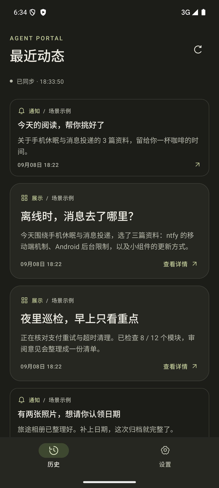
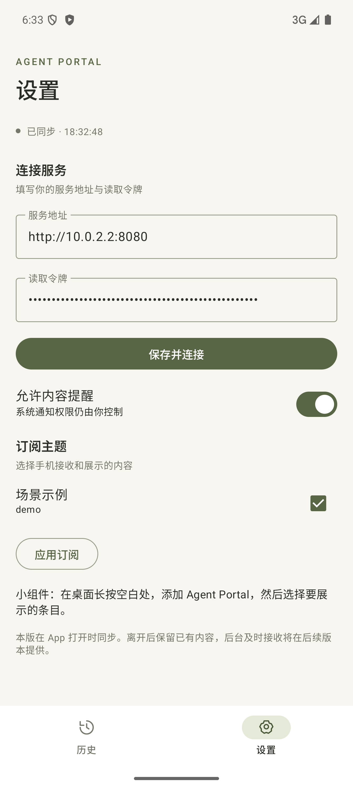
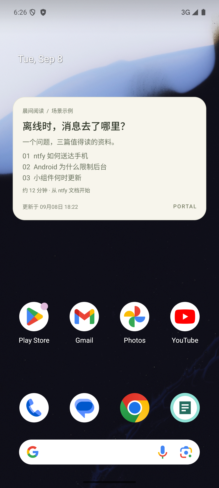
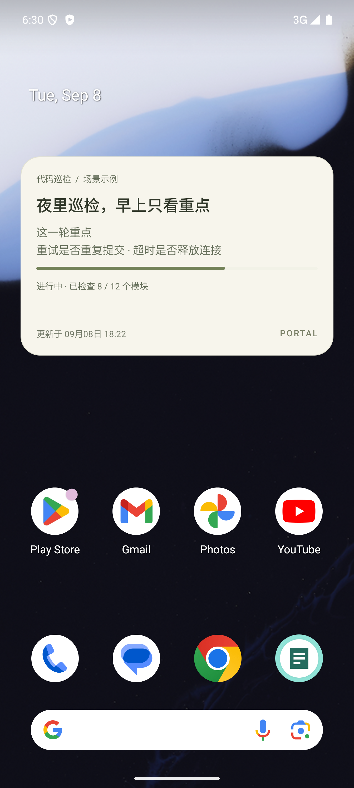
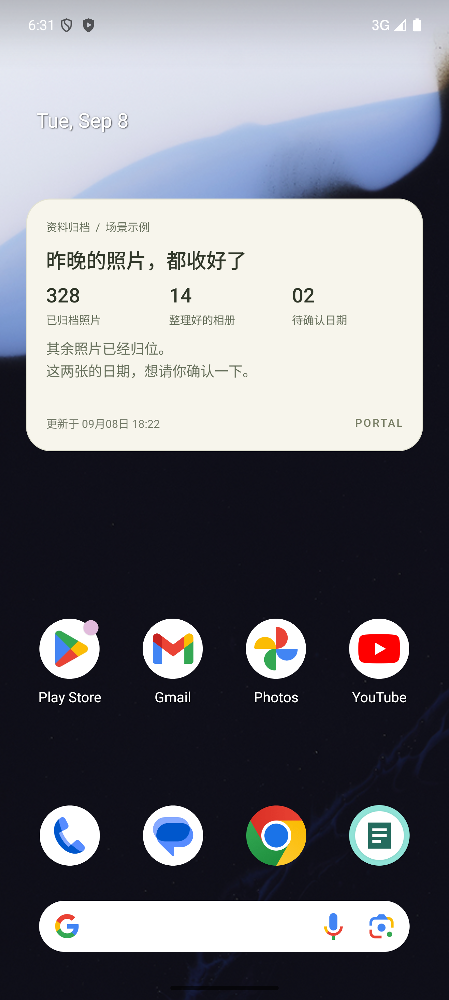

# Android 界面与场景预览

API 35 模拟器实拍。米白、墨色、橄榄绿；通知保持简短，展示卡片留出阅读空间。保留“历史 / 设置”两个入口。

| 最近动态 | 深色模式 | 设置 |
| --- | --- | --- |
|  |  |  |

| 晨间阅读 | 夜间代码巡检 | 旅途相册归档 |
| --- | --- | --- |
|  |  |  |

通过 `npm run demo -- showcase` 复现内容，或使用安装后的 `agent-portal-server demo showcase`。这些是明确标注的场景示例，不代表真实任务已经执行；[请求与模板](../../../examples/showcase/README.md)可以直接改成自己的内容。

本轮修复了小组件更新时追加旧视图、删除后残留，以及使用横屏最小高度误选竖屏精简模板的问题。历史按时间展示，通知与条目有不同的视觉层级。回归还发现并修复了服务端事件序号被当作字符串排序的问题。

验证：Android 六项功能检查、最终小组件 reapply 回归、debug 构建和 Lint、服务端九项测试、独立 npm 安装包测试及协议检查。小组件回归覆盖连续更新五次、尺寸回退和删除；服务端排序测试覆盖 115 条事件、分页及过期清理。未做性能测试，后台推送行为未改变。
